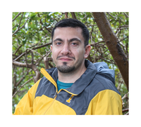

**Students**

*Yexuan Song*: MSc (Coadvised by Caroline Colijn)

   
I am interested in phylogenetics. In particular Ancestral State Reconstruction methods which are widely used in phylogenetics for identifying the character states of evolutionary ancestors.  I am also interested in using mathematical models of infectious diseases to study how diseases spread.
          
*Oliver Fujiki*: USRA 

*Rebeccah Hall*: Incoming MSc

**Postdocs**

*Amy Langdon*: PDF (Cohosted by Caroline Colijn)

   
Amy joined the MAPGIE group in Dec 2021 as a postdoctoral fellow to work on transmission modeling for ongoing pandemics. She holds a PhD in Molecular Genetics and Genomics as well as a Masters of Population Health Science from Washington University in St. Louis. Her graduate research focused on predicting the effects of medical interventions on communities of human-associated microbes in global health settings.
      

*Siavash Riazi*: PDF (Cohosted by Caroline Colijn)

 
``How much quantitative information is needed to predict a biological system? My research focuses on developing computational and mathematical tools to understand and predict biological systems. Currently I’m working on developing a new way to predict the spread of a viral disease over the course of an epidemic. I’m a computational biologist with a background in mathematical modeling of bacterial physiology/biochemistry. During my PhD I worked with Chris Marx and Chris Remien at University of Idaho. I developed a mathematical model to understand the physiological response of *Methylobacterium extorquens* to formaldehyde toxicity. This bacteria is a facultative *Methylobacterium* that lives naturally on plant leaves, and it is regularly exposed to formaldehyde. Further I used statistical methods to analyze global gene expression response of *M. extorquens* to formaldehyde toxicity and I investigated the role of EfgA, a newly found protein in tolerance to formaldehyde toxicity. In my current research I’m working on developing a new method to estimate epidemiological parameters from a given viral phylogenetic tree during the course of an epidemic. The research involves both stochastic and deterministic mathematical modeling, phylogenetic analysis and investigating parameter estimation methods.''
